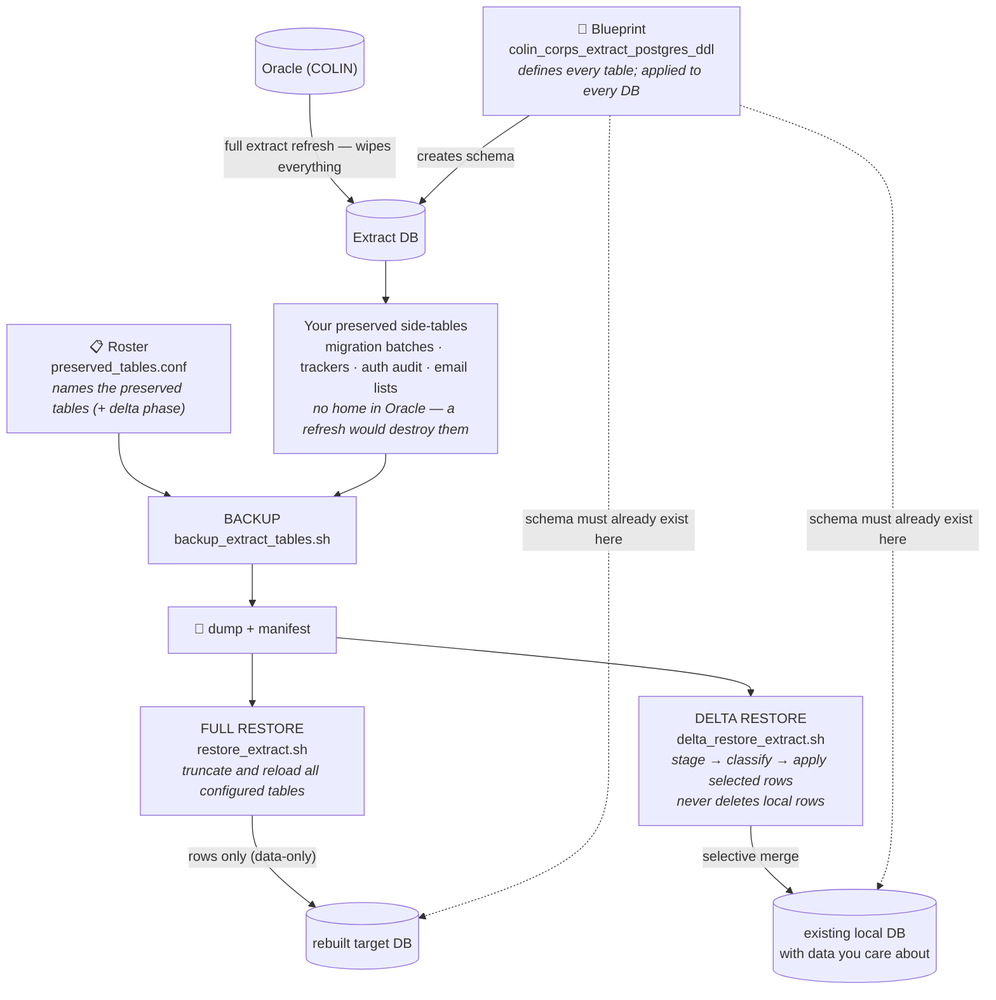

# Preserved tables — how it all works (orientation)

**Overview** · [Quick reference](README_add_preserved_table_quickref.md) · [Full guide](README_add_preserved_table.md) · [Delta runbook](README_delta_restore.md)

This is the read-first overview. When you're ready to make the edits, use the [quick reference](README_add_preserved_table_quickref.md); for depth, see the [full guide](README_add_preserved_table.md).

## The picture

## Why any of this exists

The extract database is disposable by design — it gets rebuilt from Oracle whenever a fresh extract is needed. But over time we've bolted our own tables onto it: migration batches, processing trackers, auth audit rows, email exclusion lists. Those tables have no home in Oracle; a rebuild would destroy them. The preserved-table machinery is the answer: dump those tables to a file before a rebuild, and put the data back afterward.

## Roster, schema, and delta metadata

Two files define membership and schema; delta restore also has an authoritative metadata configuration.

**The roster** (`preserved_tables.conf`) says *which* tables are preserved. One line per table. Backup and full restore read only the names. Delta restore also reads the number next to each name — a phase that orders tables so parents are handled before their children.

**The blueprint** (the big `colin_corps_extract_postgres_ddl` file) says *what* each table looks like — columns, keys, sequences. Here's the part worth internalizing: the backup file technically contains table definitions, but **restore never uses them**. Restoring is data-only — rows are poured into tables that must *already exist*, built from the blueprint. So the blueprint isn't optional paperwork; it's where the table actually comes from in every database. If the blueprint hasn't been applied to a target, restore has nowhere to put the rows, and delta restore refuses to run.

**The delta metadata authority** is `delta_ctl.complete_table_config()`. It defines how delta restore matches and relates rows; the seed mirror and stage indexes should stay aligned with it.

## Full replacement and selective merge

**Full restore** truncates every roster table in the target and reloads the dump. Use it when the target's existing preserved rows do not need to be retained.

**Delta restore** is for a target that already has preserved data you care about — for example, a local extract with tracking rows absent from the dump. It merges in three moves:

First it **stages**: the dump's rows are loaded into a scratch area shaped like your local tables, without touching real data.

Then it **classifies** every staged row by comparing it to your local table. To compare, it needs to know how to *recognize* the same logical row in both places — that's the **natural key**, the stable identity of a row (a filing id, an email address, a corp+flow+environment combo). Given the key, every row lands in a bucket: brand new here; changed, dump wins; changed, but your local copy is *newer* (protected by default); identical; blocked because something it references is missing; or ambiguous because the key isn't actually unique. Rows that exist only locally are counted and left alone — delta restore **never deletes**.

Finally it **applies** — but only what you select. You get a preview report and a selection file; by default only new and safely-changed rows are included, and you can narrow further. A few niceties happen automatically: if a dump row's ID would collide with an unrelated local row, a fresh ID is minted from the table's sequence; if a new child row depends on a new parent row, you can't apply one without the other.

## So why does adding a table take six edits?

Because the three scripts need three different levels of knowledge about your table, and the tests need a fourth.

Backup and full restore only need the table to *exist* and be *listed* — that's the blueprint and the roster, edits one and two. After those two, backup and full restore already work.

Delta restore needs effective metadata that identifies the natural key, whether the database enforces it, and which columns reference parent tables. That's edit three. Keep the bootstrap mirror (edit four) and performance-supporting stage index (edit five) aligned with it as repository conventions.

Edit six adds the table to the test fixtures. The identical fixture exercises backup, staging, and `UNCHANGED` classification; add a divergent or source-only case when you need to prove insertion, FK mapping, or ID reallocation.

The natural-key expressions and staging index must describe the same key. When `nk_enforced=true`, the blueprint must also contain a matching unique constraint or unique index. For supported unenforced keys, duplicates classify as ambiguous instead.

## Orienting yourself for a new table

Before touching anything, answer three questions in your head:

*What is this row's identity?* — the natural key. Is it truly unique, and is that uniqueness enforced by the database? If not, delta will treat duplicates as ambiguous and refuse to merge them, which is the safe default, not a bug.

*What does this row depend on?* — parents inside the preserved set (their phase must come first) or rows outside it, like corporations and events (delta checks those exist but will never create them).

*Does it have a surrogate id?* — if yes, the blueprint needs the sequence properly declared and tied to the column, because that's what powers both sequence repair after restore and fresh-ID minting during delta merges.

With those three answers, the six edits are mostly transcription — the quick reference gives the exact locations and paste-ready shapes, and every existing table in the config is a worked example.

## Where to go next

Doing it → [Quick reference](README_add_preserved_table_quickref.md) (six edits, run-to-completion, failure routing).
Understanding it deeply → [Full guide](README_add_preserved_table.md) (rationale, advanced patterns, validation runbook).
Operating delta day-to-day → [Delta runbook](README_delta_restore.md) (golden path, selection grammar, exit codes).
