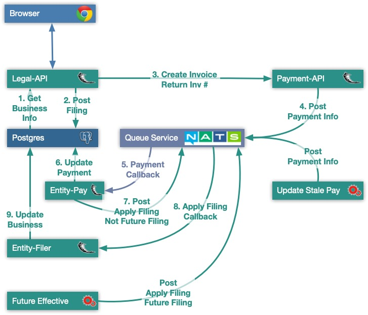

# Payment and File services in LEAR

The following diagram show the components and the flow for submitting a filing, getting the invoice number, applying the payment token and applying the filing to the business tables.

