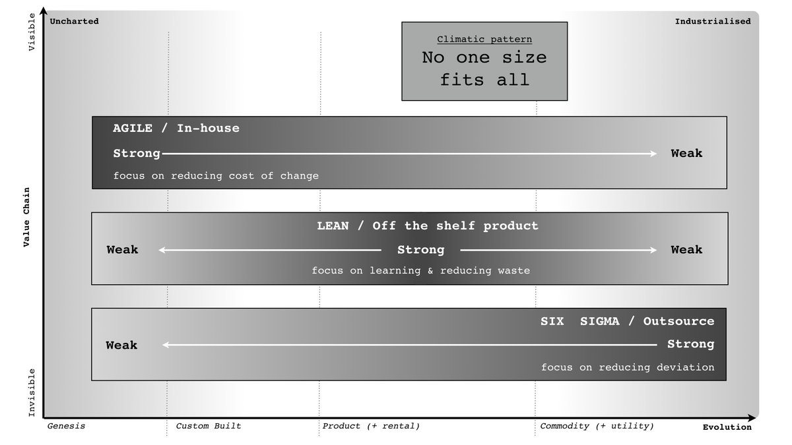

# Methodologies

The Registry employs the best methodology for the project / service at hand. The following diagram shows the 3 most popular methodologies and where there strengths lay when overlayed on a WardleyMap.

## Agile

The Registry follows a fairly standard _Scrum_ agile project management approach. It is beyond the scope of this document to cover Scrum. More info can be found at [Scrum.org](https://www.scrum.org/resources/what-is-scrum)

## Lean

Lean is not a prescriptive practice, but is a way of thinking and approach that is guided by these 7 core principles:

### The Seven Lean Principles

#### Optimize the whole

Every business represents a value stream, the sequence of activities required to design, produce, and deliver a product or service to customers. If our goal is to deliver as much value to our customers as quickly as possible, then we must optimize our value streams to be able to do just that. To understand how to optimize our value streams, first we must properly identify them (value streams).

#### Eliminate waste

Lean thinking encourages this definition of waste: If your customer wouldn’t pay for it, it’s waste. Waste, in knowledge work, can be:

- Context switching
- Too much work in process
- Time spent manually completing a task that could be automated

#### Build quality in

As businesses grow, the limitations of homegrown systems expose themselves. Lean companies set themselves up for sustainable growth by practicing the Lean principle of Building Quality In.

The concept is simple: Automate and standardize any tedious, repeatable process, or any process that is prone to human error. This allows Lean companies to error-proof significant portions of their value streams, so they can focus their energy on creating value for their customers.

#### Deliver fast

When a piece of work reaches your customer, it’s valuable. Until then, it isn’t.

The Lean principle of Deliver Fast by Managing Flow is based on the idea that the faster we can deliver bits of value to our customers, the sooner we can begin to learn from customer feedback. The more we learn from our customers, the better able we are to give them exactly what they want.

In order to deliver fast, we have to manage flow, by limiting work in process and maintaining a relentless focus on value delivery.

#### Create knowledge

The Lean principle of Create Knowledge is related to the concept of Optimizing the Whole. A Lean organization is a learning organization; it grows and develops through analyzing the results of small, incremental experiments.

To retain that information as an organization, the learning must be shared. The Lean principle of Create Knowledge says that Lean organizations must provide the infrastructure to properly document and retain valuable learning.

#### Defer commitment

Lean thinking is derived from the manufacturing philosophy of Toyota, which emphasized a just-in-time system of inventory management. The Lean principle of Defer Commitment says that Lean organizations should also function as just-in-time systems, waiting until the last responsible moment to make decisions. This allows Lean organizations to have the agility to make informed decisions, with the most relevant, up-to-date information available.

#### Respect people

The success of any Lean initiative hinges upon one Lean principle: Respect People. Out of respect for the customer, we make decisions that will bring them the most value with minimal waste. Out of respect for our employees, we create environments that allow everyone to do their best work. Out of respect for our coworkers, we continuously strive to optimize our processes to allow everyone to deliver the most value they can provide.

## Sigma

Six Sigma is a disciplined, statistical-based, data-driven approach and continuous improvement methodology for eliminating defects in a product, process or service. More information on [6&sigma;](http://leansixsigmadefinition.com/glossary/six-sigma/)
