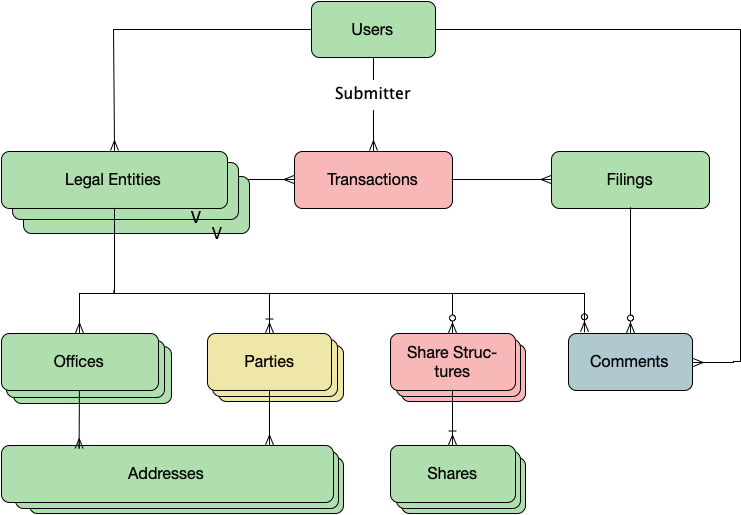

# Entity-<issue #>: 
## LEAR: <registration number, eg CP0000001>
## - task description

**Note:** The historical change/correction filings are not in production yet, so this will need to be done via direct changes to the services DB.

## setup the environment


```python
%run ./bcr-business-setup.ipynb
```

    Unable to configure logging, attempted conf:/usr/local/lib/python3.8/site-packages/legal_api/logging.conf


## set the registration number of the business eg. CP0001234


```python
registration_number = 'CP0001790'
```

## lookup the business and ensure it is the one you want to change


```python
business = legal_api.models.Business.find_by_identifier(registration_number)
business.id, business.identifier, business.legal_name
```


    (233, 'CP0001790', 'REALIZE STRATEGIES CO-OPERATIVE')


## lookup the correction filing
the filing contents will be echo'ed below for reference


```python
filing = legal_api.models.Filing.get_most_recent_legal_filing(business.id, 'annualReport')
filing.id, filing.status, filing.paper_only, filing.filing_json
```


    (50208,
     'COMPLETED',
     True,
     {'filing': {'header': {'date': '2019-01-18',
        'name': 'changeOfDirectors',
        'historic': True,
        'effectiveDate': '2019-01-18',
        'availableOnPaperOnly': True},
       'business': {'status': 'Active',
        'cacheId': 0,
        'corpState': 'ACT',
        'legalName': 'REALIZE STRATEGIES CO-OPERATIVE',
        'legalType': 'CP',
        'identifier': 'CP0001790',
        'lastArDate': '2018-12-19',
        'lastAgmDate': '2018-12-19',
        'foundingDate': '1998-10-07T00:00:00-00:00',
        'jurisdiction': 'BC',
        'businessNumber': None,
        'lastLedgerTimestamp': '2019-01-18T00:00:00-00:00'},
       'changeOfDirectors': {'eventId': 102021755,
        'annualReportDate': None,
        'annualGeneralMeetingDate': None}}})


### the following checks if the filing has already been processed.
**if it has been processed already, then either of the following 2 calls will fail and processing will stop _IFF_ this is being run by papermill**

if this is being run from a job environment, it'll stop if the following checks are valid


```python
stop_on_true(filing.status=='COMPLETED', "Can't process a completed filing.")
stop_on_true(filing.transaction_id is not None, "Can't process a filing already associated with a transaction.")
```

## Model - for reference
run this cell if you want to see an image of the domain model



```python
import pycountry
from legal_api import db
from legal_api.models import Address, Business, Filing, Office
from sqlalchemy_continuum import versioning_manager
```


```python
uow = versioning_manager.unit_of_work(db.session)
transaction = uow.create_transaction(db.session)
```

## Change core busines details
uncomment and set any of the values


```python
# business.last_agm_date =
# business.last_ar_date = 
# business.legal_name = 
# business.legal_type =
# business.founding_date 
# business.dissolution_date =
# business.identifier = 
# business.tax_id = 
# business.fiscal_year_end_date = 
```

# Fix addresses

### find all of the addresses

Office types are in <span style="color: #0000ff">BLUE</span> ;
Address proporties are in <span style="color: #ff0000">RED</span> 


```python
offices = business.offices.all()
for office in offices:
    print(f"\x1b[34m{office.office_type}\x1b[0m")
    addresses = office.addresses.all()
    for address in addresses:
        print (f"\x1b[31mAddress.id=\x1b[0m{address.id}, \x1b[31mtype=\x1b[0m{address.address_type},\n\x1b[31mjson=\x1b[0m{address.json}")
```

    registeredOffice
    Address.id=2007, type=mailing,
    json={'streetAddress': '503-535 THURLOW STREET', 'streetAddressAdditional': '', 'addressType': 'mailing', 'addressCity': 'VANCOUVER', 'addressRegion': 'BC', 'addressCountry': 'CA', 'postalCode': 'V6E 3L2', 'deliveryInstructions': ''}
    Address.id=2008, type=delivery,
    json={'streetAddress': '503-535 THURLOW STREET', 'streetAddressAdditional': '', 'addressType': 'delivery', 'addressCity': 'VANCOUVER', 'addressRegion': 'BC', 'addressCountry': 'CA', 'postalCode': 'V6E 3L2', 'deliveryInstructions': ''}


### find the address to fix


```python
office = business.offices.filter_by(office_type='registeredOffice').one_or_none()
address_to_fix = office.addresses.filter_by(id=2007).one_or_none()
address_to_fix.json
```


    {'streetAddress': '503-535 THURLOW STREET',
     'streetAddressAdditional': '',
     'addressType': 'mailing',
     'addressCity': 'VANCOUVER',
     'addressRegion': 'BC',
     'addressCountry': 'CA',
     'postalCode': 'V6E 3L2',
     'deliveryInstructions': ''}


### change the address info


```python
# address_to_fix.street = 'streetAddress'
# address_to_fix.street_additional = 'streetAddressAdditional'
# address_to_fix.city = 'addressCity'
# address_to_fix.region = 'addressRegion'
# address_to_fix.country = pycountry.countries.search_fuzzy('CA')[0].alpha_2
# address_to_fix.postal_code = 'postalCode'
# address_to_fix.delivery_instructions = 'deliveryInstructions'
```

# Directors


```python
for director in business.directors:
        print (f"\x1b[31mDirector.id=\x1b[0m{director.id}, \x1b[31mName=\x1b[0m{director.first_name} {director.last_name}\n\x1b[31mjson=\x1b[0m{director.json}")
        
```


```python
director_to_fix = business.directors.filter_by(id=1520).one_or_none()
director_delivery_address = director_to_fix.delivery_address
director_mailing_address = director_to_fix.mailing_address
director_to_fix.json
```


```python
# director_to_fix.first_name = 
# director_to_fix.middle_initial = 
# director_to_fix.last_name = 
# director_to_fix.title = 
# director_to_fix.appointment_date = 
# director_to_fix.cessation_date =
# director_delivery_address = 
```


```python
# director_delivery_address.address_type = 'delivery'
# director_delivery_address.street = 
# director_delivery_address.street_additional = 
# director_delivery_address.city = 
# director_delivery_address.region = 
# director_delivery_address.country = pycountry.countries.search_fuzzy('CA')[0].alpha_2
# director_delivery_address.postal_code = 
# director_delivery_address.delivery_instructions = 
```


```python
# director_mailing_address.address_type = 'delivery'
# director_mailing_address.street = 
# director_mailing_address.street_additional = 
# director_mailing_address.city = 
# director_mailing_address.region = 
# director_mailing_address.country = pycountry.countries.search_fuzzy('CA')[0].alpha_2
# director_mailing_address.postal_code = 
# director_mailing_address.delivery_instructions = 
```

# Save the changes to the database


```python
filing.transaction_id = transaction.id
filing.set_processed()

db.session.add(business)
db.session.add(filing)
db.session.commit()
```

### save a copy of this book as markdown


```javascript
%%javascript
IPython.notebook.kernel.execute('nb_name = "' + IPython.notebook.notebook_name + '"')
```


```python
md_name = nb_name[:-6]+'.md'
```


```bash
%%bash -s "$nb_name" "$md_name"
jupyter nbconvert $1 --to markdown --output $2
```


```python

```
